# Hamster User Quick Access

## Download Hamster-client

Before you can download the Hamster-client client, you need to go to the official Hamster website (https://hamsternet.io/). Click Download under the Banner on the Hamster website to enter the download screen.

## Installing Hamster-Client

As shown in the picture, go to the one-click deployment interface and select Hamster Network.

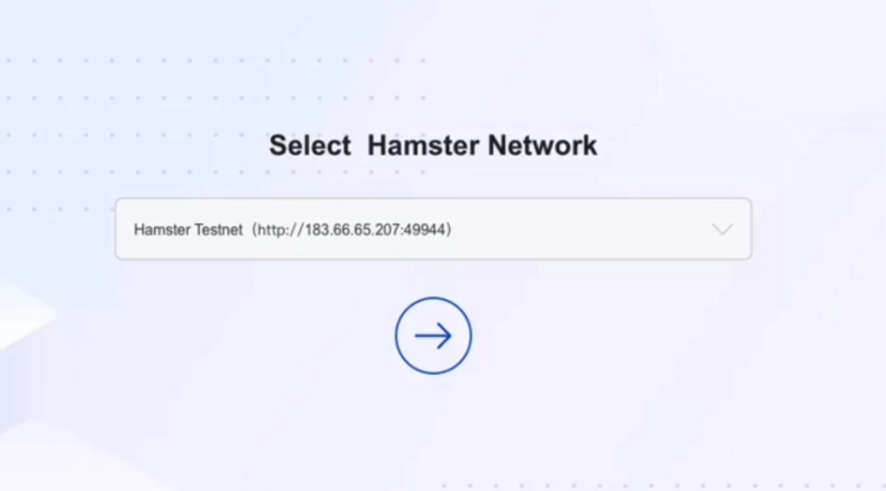

## Select wallet

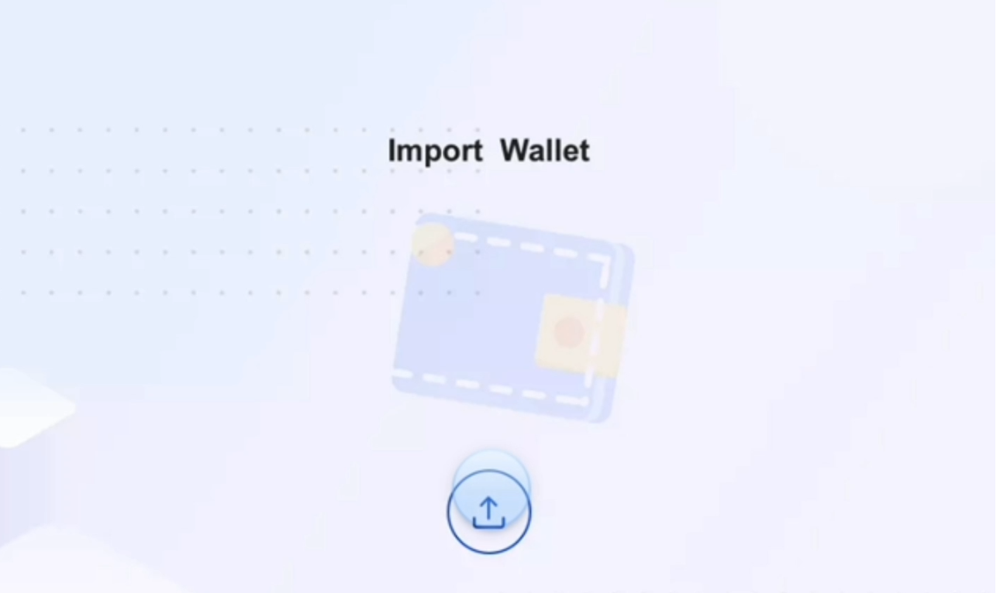

## Enter wallet

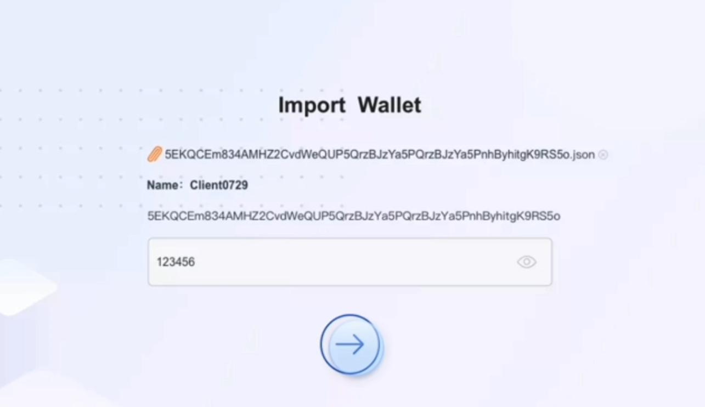

## Create project

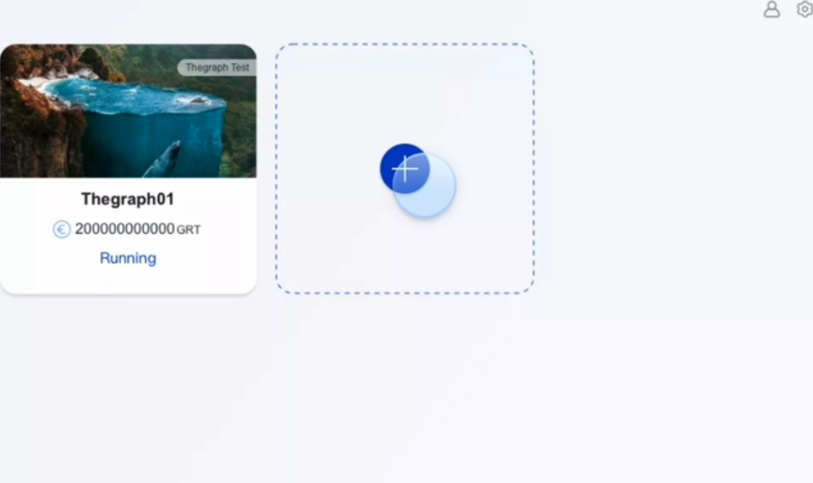

## Fill in the project node

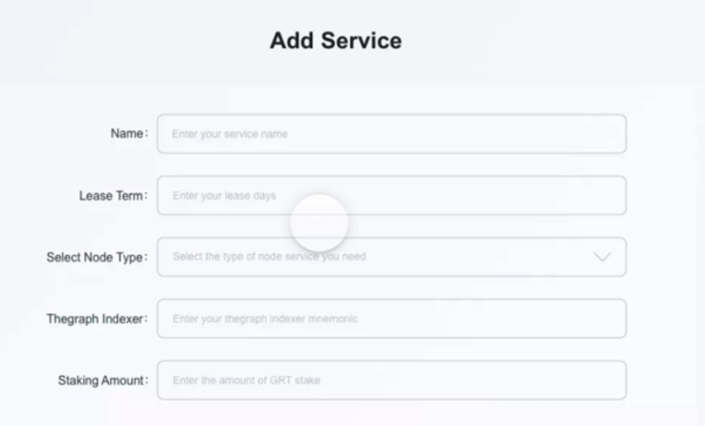

## Deployment nodes are shown in the figure

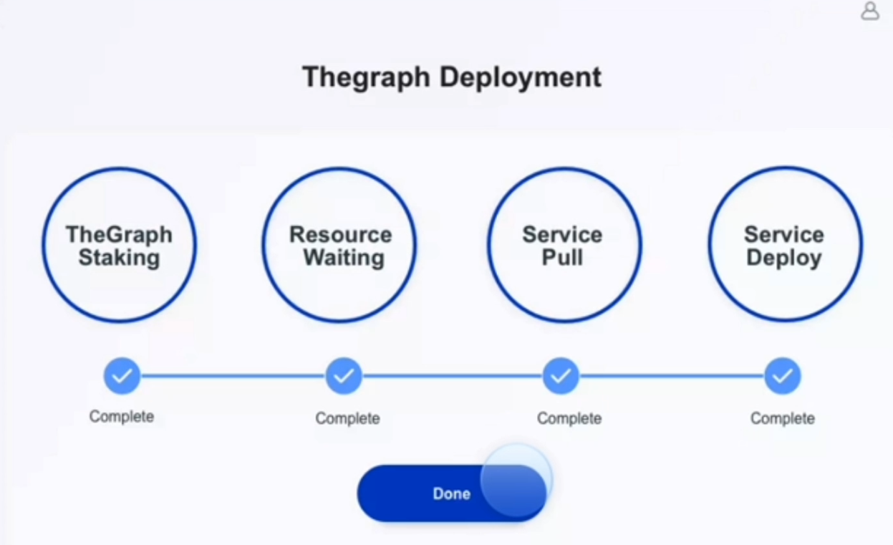

## Deployment completed

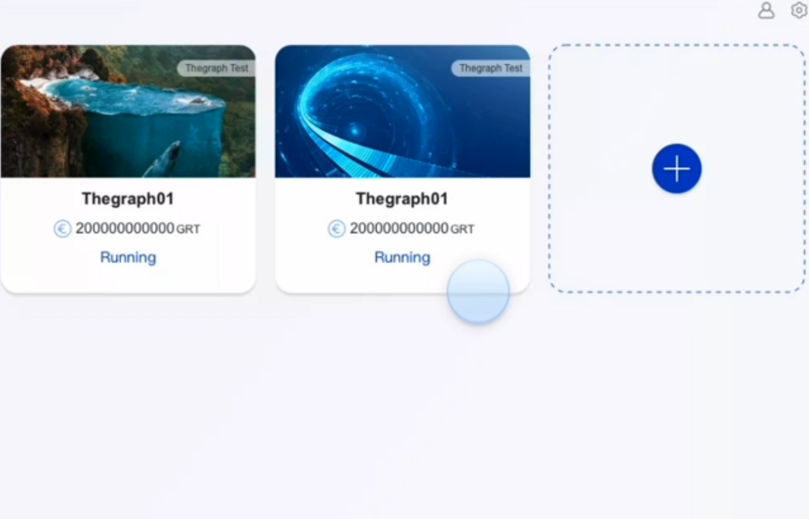

## View Deployment Parameters

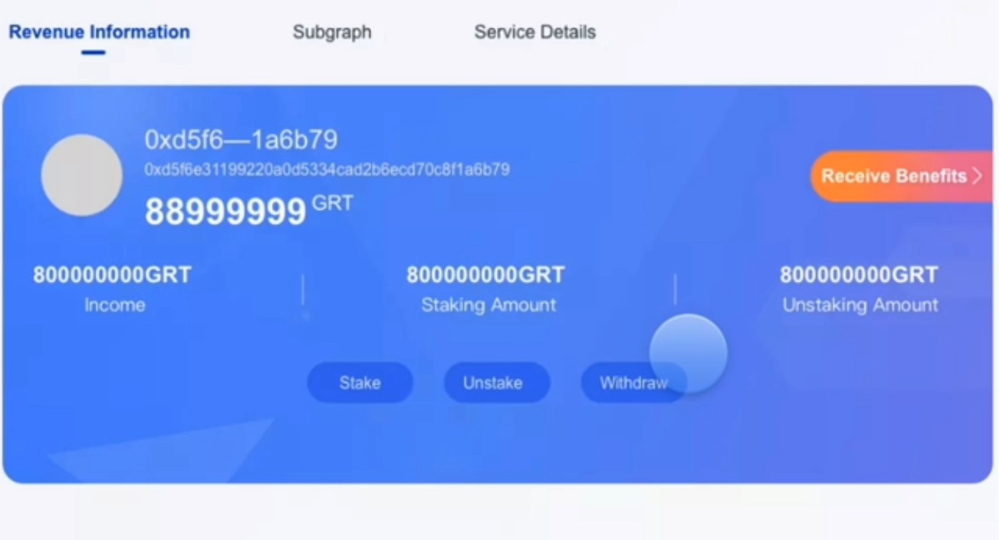

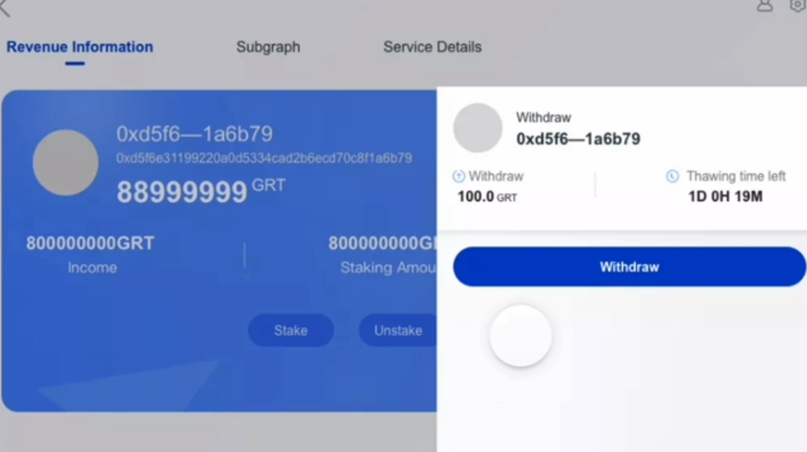

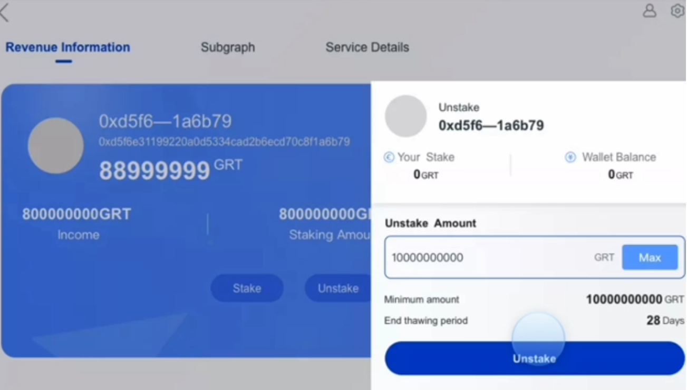

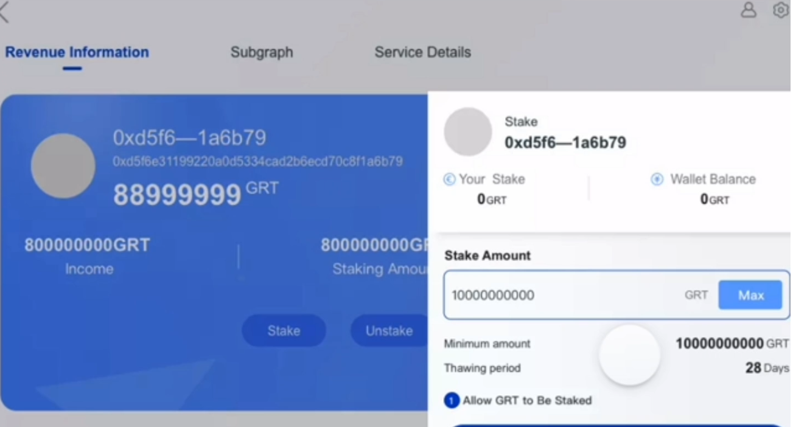

## View the list of subgraphs

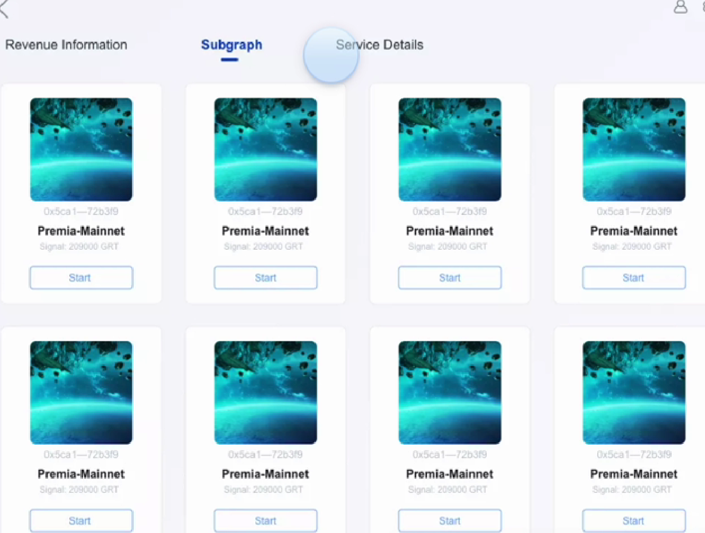

## View Deployment Details

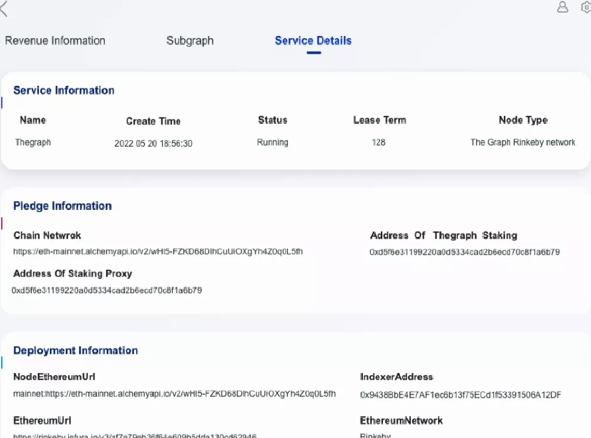