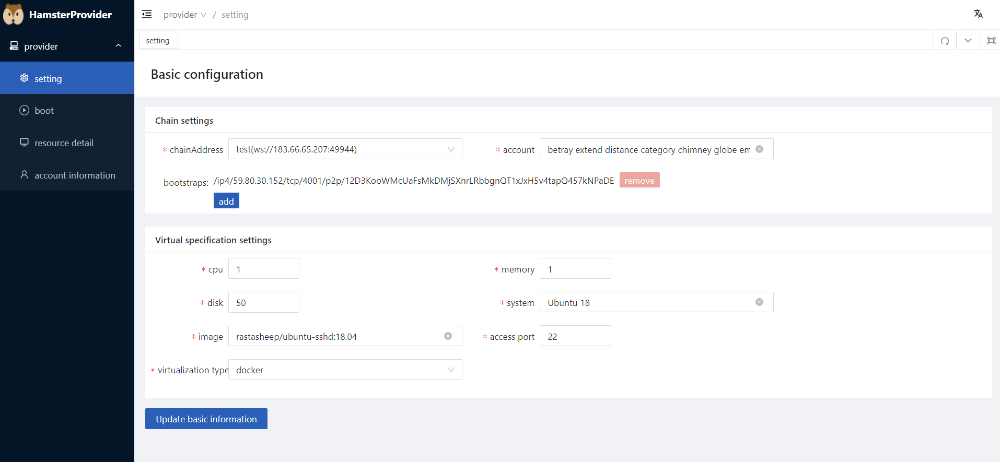
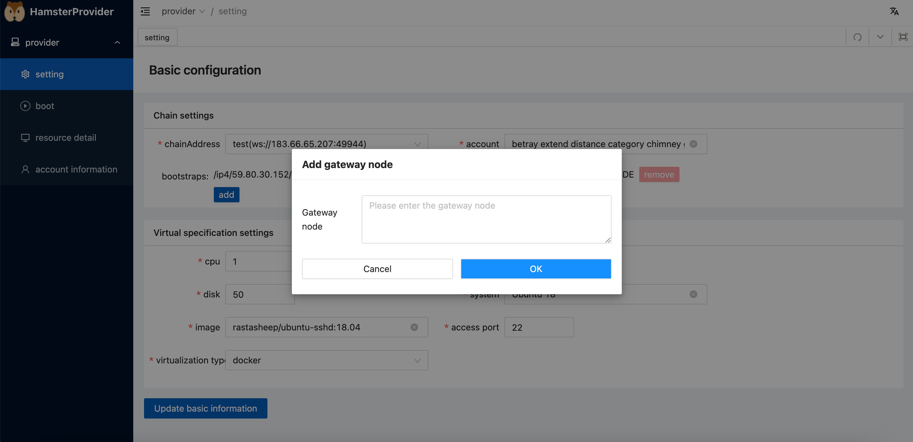
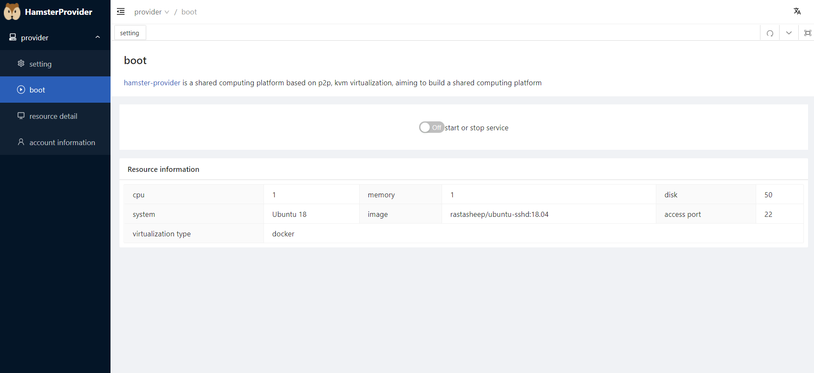

# Hamster User Quick Access

Before installing any client, make sure your computer has enough resources to run it. The minimum and recommended requirements are as follows:

### Operating the node

You should regularly monitor your node to make sure it's running properly. You may need to do occasional maintenance.

### Keeping node online

Your node doesn't have to be online nonstop, but you should keep it online as much as possible to keep it in sync with the network. You can shut it down to restart it, but keep in mind that:

- Shutting down can take up to a few minutes if the recent state is still being written on disk.
- Forced shut downs can damage the database.
- Your client will go out of sync with the network and will need to resync when you restart it. This takes depending on how long it has been offline.

This doesn't apply on consensus layer validator nodes. Taking your node offline will affect all services dependent on it. If you are running a node for *staking* purposes you should try to minimize downtime as much as possible.

### Recommended specifications

|      | Minimum Specs | Recommended Specs |
| :--: | :-----------: | :---------------: |
| CPU  |    8 vcore    |     16 vcore      |
| RAM  |     16 GB     |       32GB        |

------

## Download Hamster-Provider

Before you can download the Hamster-Provider client, you need to go to the official Hamster website (https://hamsternet.io/). Click Download on the Banner above the Hamster website to enter the download screen.

## Install Hamster-Provider

As shown in the figure, go to the Provider screen and select the link address.

## Adding Web Joints

Click Add, add a gateway joint, click Update Basic Information

## Open Enjoy Service

Click to open the service

